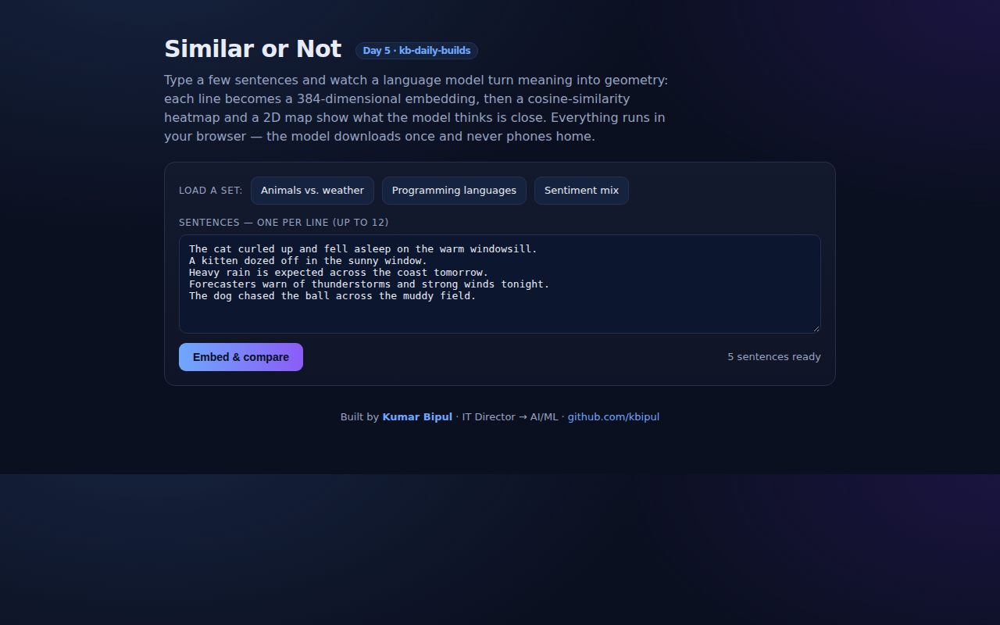

<div align="center">

# Similar or Not — Watch Meaning Become Geometry

**Type a handful of sentences and see them embed, cluster on a 2D map, and light up a cosine-similarity heatmap. An embeddings playground running 100% in your browser.**

[](https://github.com/kbipul/similar-or-not/actions/workflows/ci.yml)
[](https://kbipul.github.io/similar-or-not/)

`Day 5` of **[kb-daily-builds](https://github.com/kbipul/kb-daily-builds)** — one AI project a day.

</div>

## What it does

Embeddings sit behind semantic search, RAG, clustering and dedup, and you almost never get to look at one. Similar or Not makes them visible. Paste a few sentences, and a small language model turns each into a 384-dimensional vector. The app then draws two views of what the model "thinks". The cosine-similarity heatmap scores every pair. The 2D PCA map places the sentences so that closer dots mean closer meaning. Near-duplicate lines snap together; unrelated ones drift apart.

It is a teaching tool and a sanity check. Drop in your own labels or documents and see whether the model actually separates the categories you care about, before you wire embeddings into a pipeline. Three preset sets ship in `src/lib/samples.ts` so the map shows structure on first load.



> The screenshot is captured automatically by this repo's CI on a GitHub runner (the build sandbox can't run a browser) and committed to `docs/demo.png` within minutes of publish.

## Try it

**[Live demo →](https://kbipul.github.io/similar-or-not/)** runs fully in your browser. The model (~23MB) downloads once and is cached.

```bash
git clone https://github.com/kbipul/similar-or-not
cd similar-or-not
npm ci
npm run dev      # open the printed localhost URL
npm test         # run the vector-math unit tests
npm run build    # type-check + production build
```

## How it works

```
sentences ──► transformers.js (all-MiniLM-L6-v2, mean-pooled + L2-normalized)
                     │
                384-dim vectors
                ┌────┴─────────────┐
        cosine matrix          PCA → top 2 PCs
         (heatmap)              (2D scatter)
```

Two decisions worth calling out.

All the linear algebra is hand-rolled and pure. `cosine`, `similarityMatrix` and a small power-iteration `pca2d` live in `src/lib/vec.ts` with no React and no model imports, which is what makes the unit tests fast and deterministic. `topEigenvector` seeds itself with the fixed vector 1, 1/2, 1/3, … and runs 80 iterations, so the map does not jump around between renders.

The model is isolated behind one wrapper. `embed.ts` is the only file that imports `@huggingface/transformers` or touches the network. It mean-pools and L2-normalizes so cosine similarity is well-behaved, and the model name is a single `MODEL_ID` constant, so swapping in a different embedding model is a one-line change.

## Build notes

The fun part was refusing to `npm install` a PCA. A 2D projection of embeddings sounds like it needs a heavyweight numerics library, but the top two principal components fall out of about a dozen lines of power iteration: project every centered vector onto the current estimate, sum, normalize, repeat. Then deflate, stripping the first component out of every row, and run the same loop again for the second. Writing it myself meant I could seed it deterministically. A map that reshuffles on every keystroke feels broken even when the geometry underneath is identical.

Because the math is pure, `src/lib/__tests__/vec.test.ts` can assert real properties without downloading a model or touching a DOM: cosine of a vector with itself never drifts past 1, orthogonal vectors read 0, clustered inputs stay closer in the projection than an outlier. Both bugs it caught were in `fitToBox`. The Y axis was flipped the wrong way, and the scaling divided by zero when every point shared a coordinate. The spans now fall back to 1.

## What the 2D map is hiding

PCA is a *linear* shadow of a very non-linear space. The map keeps 2 of the 384 dimensions and throws away 382 to fit on your screen, so two sentences can look near each other on the map and still score lower on the heatmap. Both views are on screen side by side for that reason. When they disagree, the heatmap is the one to trust; the map is intuition.

What I have not done is put a number on the distortion. There is nothing in the repo that measures how much the projection loses, and I would want that measurement before trusting the map for anything beyond a demo. Cosine similarity has the same problem from the other direction: it collapses a pair of 384-dimensional vectors into one scalar, and I have not checked what that scalar ignores. The "Sentiment mix" preset in `samples.ts` is the obvious test. It mixes "the best meal I have had all year" with "I want a refund", which are opposite in sentiment and near-identical in topic, and I do not know yet whether the heatmap splits them or the restaurant-review vocabulary dominates. My guess is the topic wins, but I have not run it and counted.

UMAP or t-SNE would give a prettier layout than power iteration. I have not tried either here, so I cannot say whether the extra dependency buys anything past looking better. The from-scratch PCA does stay explainable and dependency-light, which is why it is still in.

## Stack

| Layer | Choice |
|---|---|
| UI | React 18 + TypeScript 5 |
| Embeddings | transformers.js · `Xenova/all-MiniLM-L6-v2` (on-device) |
| Math | hand-written cosine + power-iteration PCA (no deps) |
| Build/test | Vite 6, Vitest 2 |
| Deploy | GitHub Pages (static, no backend) |

---

<div align="center"><sub>
Built by <a href="https://www.kumarbipul.com"><b>Kumar Bipul</b></a> ·
IT Director → AI/ML · <a href="https://github.com/kbipul">github.com/kbipul</a>
</sub></div>
